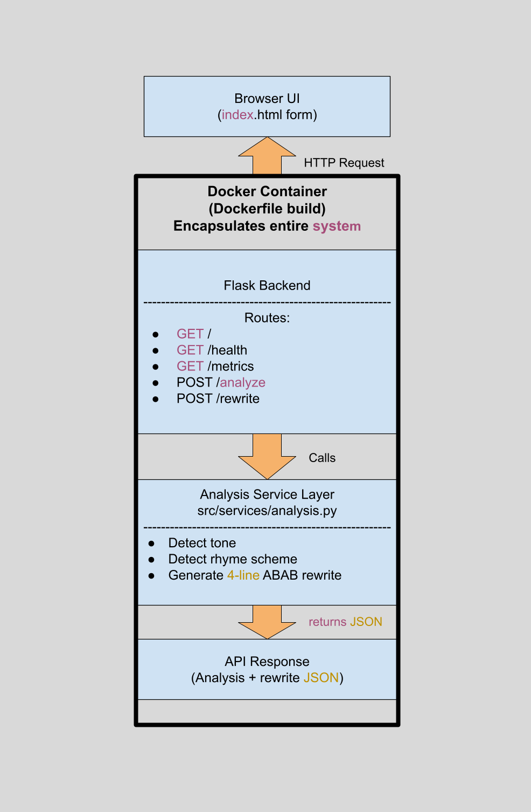
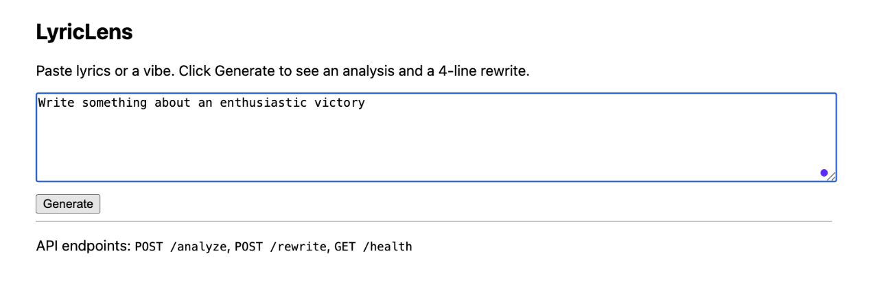
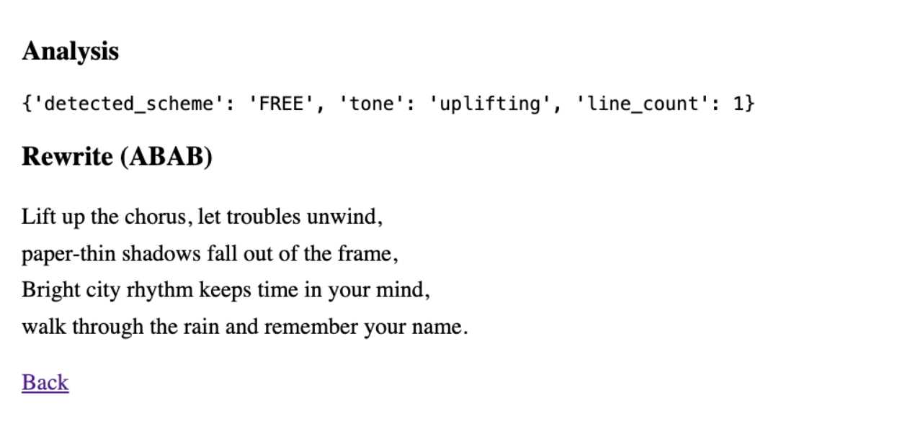
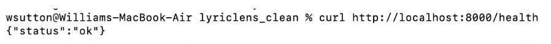
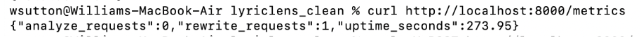

# LyricLens 🎵  
A lightweight, containerized lyric analysis and rewrite tool built with Flask.

LyricLens takes a short piece of text (lyrics, themes, prompts, or a general vibe) and returns two things:

1. A simple analysis (tone, rhyme pattern, line count)
2. A rewritten 4-line lyric in an ABAB rhyme scheme

The system is fully self-contained, reproducible, and runs inside a Docker container with built-in observability.

---

# 1) Executive Summary

### **Problem**
Writers, musicians, and students frequently want quick feedback on tone and rhyme structure without using heavy NLP models. Many existing tools require complex APIs, large ML pipelines, or do not offer any transparency into how the analysis is performed.

### **Solution**
LyricLens is a lightweight microservice that performs lyric analysis and stylized rewrites using only Python and Flask. Users enter text through a simple HTML interface, and the service returns:
- Detected tone  
- Detected rhyme pattern  
- Line count  
- A newly generated 4-line ABAB rewrite  

The backend includes observability features (`/health`, `/metrics`) for monitoring uptime and usage, and the entire system is packaged inside a portable Docker container for easy reproducibility.

---

# 2) System Overview

### **Course Concepts Used**
This project integrates key concepts from the Systems curriculum:

- **Flask API Design:** Multiple GET and POST routes  
- **Observability:** `/health` endpoint, `/metrics` endpoint with uptime + request counters  
- **Containerization:** Fully reproducible Dockerfile  
- **Modular Code Design:** Separation of service logic (`analysis.py`) from the Flask routing layer

---

### **Architecture Diagram**
Image located at `assets/architecture.png`.



---

### **Data, Models, and Services**

| Component | Description |
|----------|-------------|
| **Flask Backend (app.py)** | Registers UI route, analysis/rewrite API routes, and observability endpoints. |
| **Analysis Service (src/services/analysis.py)** | Detects tone, detects rhyme pattern, and generates ABAB rewrites. |
| **UI (index.html)** | Simple browser interface for text input. |
| **Observability** | Logs and `/metrics` track uptime and request counts. |
| **No external dataset/model** | Entire application runs deterministically with no external ML model. |

---

# 3) How to Run (Local via Docker)

This application is fully containerized. To run locally:

### **Build the Docker image**
```bash
docker build -t lyriclens .

Run the container
docker run --rm -p 8000:8000 lyriclens

Health Check
curl http://localhost:8000/health

Metrics
curl http://localhost:8000/metrics

Analyze Example
curl -X POST http://localhost:8000/analyze -d "text=hello"
```

# 4) Design Decisions

### **Why This Concept?**
Flask was selected as the core framework because it provides a minimal, flexible environment for building microservices. It supports multiple HTTP routes, integrates cleanly with Python modules, and is straightforward to containerize. This makes it an ideal choice for demonstrating core course concepts without unnecessary complexity.

### **Alternatives Considered**
- **FastAPI:** Offers automatic documentation and type validation, but introduces overhead beyond what this project requires.
- **Client-Side JavaScript Only:** Insufficient for controlled rewrite logic and does not support observability endpoints.
- **Large NLP Models:** More powerful but unnecessary; they slow down startup time and increase Docker image size.

### **Tradeoffs**
- **Heuristic-based analysis:** Very fast and deterministic but less expressive than ML-driven approaches.
- **Single-container design:** Highly portable but not horizontally scalable.
- **Minimal UI:** Prioritizes clarity over visual flair.

### **Security & Privacy**
- No user data is persisted.
- Inputs are processed in-memory only.
- No API keys, databases, or external integrations reduce overall risk.
- A `.env.example` is provided; no secrets are included in the repo.

### **Operations & Observability**
- `/health` provides a simple liveness check.
- `/metrics` tracks:
  - uptime in seconds  
  - number of analyze requests  
  - number of rewrite requests  
- Logging is performed on analyze and rewrite events to aid debugging.

### **Continuous Integration (CI)**
A GitHub Actions workflow (`.github/workflows/ci.yml`) automatically runs on each
push to the `main` branch. This workflow:

- Installs project dependencies  
- Performs a Python smoke test by importing the Flask app  
- Builds the Docker image to ensure container reproducibility  

This validates that the application builds cleanly and satisfies the CI portion
of the Observability/CI extra credit requirement.

---

# 5) Results & Evaluation

### **UI Example**
*(See `assets/ui_example.png`)*  


### **Rewrite Example**
*(See `assets/rewrite_example.png`)*  


### **Health Check**
*(See `assets/health_check.png`)*  


### **Metrics Example**
*(See `assets/metrics_example.png`)*  


### **Analyze Example**
*(See `assets/analyze_example.png`)*  


### **Performance Notes**
- Response time is typically 1–3 ms locally.
- Docker image builds quickly due to minimal dependencies.
- All logic is deterministic, improving reproducibility.
- No external network calls → highly stable execution.

---

# 6) What’s Next

### **Planned Enhancements**
- Add richer NLP sentiment or rhyme-scoring models.
- Add selectable rewrite styles (rap, haiku, heartbreak, inspirational).
- Introduce a database for logging requests or storing user sessions.
- Expand observability with Prometheus-compatible metrics.
- Write automated unit tests for analysis and rewrite logic.
- Add  local AI text generation via an Ollama-served LLM (e.g., Llama3, Mistral) to enable richer rewrites and offline processing.

### **Refactors**
- Refactor repeated code in /analyze and /rewrite into a shared utility function.
- Improve error handling (e.g., return structured error JSON for bad inputs).

### **Stretch Features**
- Deploy to Render or Fly.io for a public, stable cloud URL (+5 extra credit).
- Add a small React front-end for improved UI/UX.

---

# 7) Links

**GitHub Repository:**  
<INSERT-GITHUB-URL-HERE>

**Cloud Deployment (Optional):**  
_No cloud deployment was required for this submission, but the app is container-ready._

---

# LICENSE  
Distributed under the MIT License. See `LICENSE` for details.
